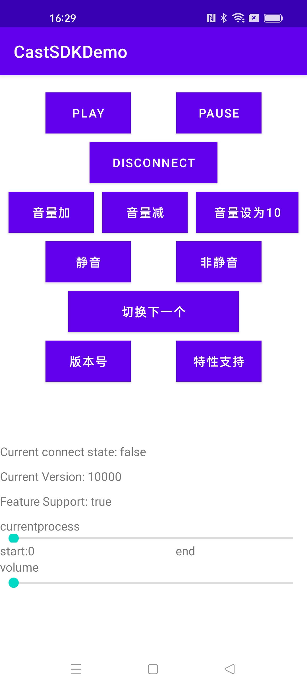

CastUnit Demo App
=====

English | [简体中文](./README-CN.md)



## About CastUnit

[CastUnit] is an open interface for OPPO's video continuous play capabilities. 
Users can implement video continuous play between phone and TV in third-party applications.

This project provides a solution for accessing the ability to CastUnit SDK,
see [Configuration and initialization instructions][CastUnitInstructions]
allowing you to refer to its call logic during the use of the SDK.

Supported devices:

CastUnit currently provides full-platform support for domestic models of ColorOS12.1 and above, and will gradually support domestic models of ColorOS12.0 in the future.

## About CastUnit Demo App
Now, we provide a sample program to show you the calling process of the interface.

## Status
Version 1.0.0 is now released and stable. Updates are released periodically with new features and bug fixes.

Comments/Bugs/Questions/PR are always welcome! Please read [CONTRIBUTING.md][contributing] on how to report issues.

## Build
Building project with gradle is fairly straight forward:

```shell
git clone git@github.com:oppo/CastUnit.git
cd CastUnit
./gradlew :app:assembleRelease
```

**Note**: Make sure your *Android SDK* has the *Android Support Repository* installed, and that your `$ANDROID_HOME` environment
variable is pointing at the SDK or add a `local.properties` file in the root project with a `sdk.dir=...` line.

## Development
Follow the steps in the [Build](#build) section to setup the project and then edit the files however you wish.
[Android Studio][android-studio] cleanly imports both CameraUnit's source and tests and is the recommended way to work with CameraUnit.

To open the project in Android Studio:

1. Go to *File* menu or the *Welcome Screen*
2. Click on *Open...*
3. Navigate to CastUnit's root directory.
4. Select `setting.gradle`

## Issues & Getting Help
To report a specific problem or feature request, [open a new issue on Github][open-new-issue]. For questions, suggestions, or
anything else, email [CameraUnit's discussion group][discussion].

Please make sure to read the [Issue Reporting Checklist][issue-reporting-guidelines]
before opening an issue. Issues not conforming to the guidelines may be closed immediately.

## Contribution
Please make sure to read the [CONTRIBUTING.md][contributing] before making a pull request. 
For more details, see the [Contributing docs page][contributing-page].

Thank you to all the people who already contributed to this project!

## Thanks
* Everyone who has contributed code and reported issues!

## Author
@Wei Zhang at oppo, [@Wei Zhang](https://github.com/zhangweinj) at oppo.

## License
[Apache License 2.0][license]

Copyright (c) 2022 OPPO. All rights reserved.

[CastUnitLink]: https://open.oppomobile.com/newservice/capability?pagename=castunit
[CastUnitInstructions]: https://open.oppomobile.com/wiki/doc#id=10751
[issue-reporting-guidelines]: #
[open-new-issue]: https://github.com/oppo/CameraUnit/issues
[android-studio]: https://developer.android.com/studio
[contributing-page]: https://github.com/oppo/CastUnit/blob/main/CONTRIBUTING.md
[discussion]: https://github.com/oppo/CastUnit/issues
[contributing]: https://github.com/oppo/CastUnit/blob/main/CONTRIBUTING.md
[license]: https://www.apache.org/licenses/LICENSE-2.0
